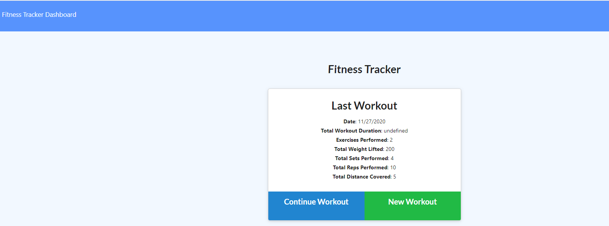
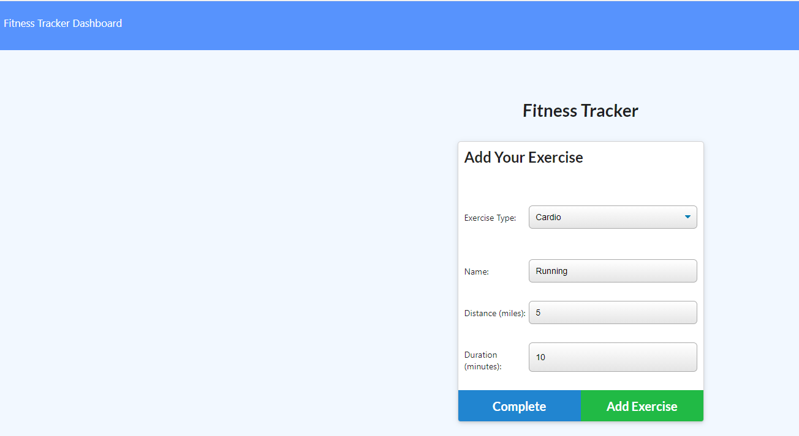
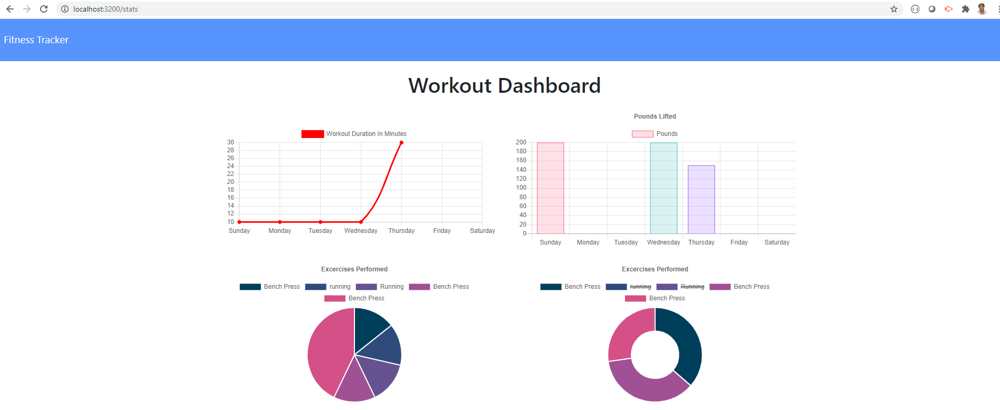

# Workout Tracker

> AS A user,
  I WANT to be able to view, create and track daily workouts. 
  I want to be able to log multiple exercises in a a workout on a given day. 
  I should also be able to track the name, type, weight, sets, reps and duration of exercise. If the exercise is a cardio exercise, I should be able to track my distance traveled.

---

### Table of Contents

- [Description](#description)
- [Technologies](#technologies)
- [How To Use](#how-to-use)
- [License](#license)
- [Author Info](#author-info)

---

## Description

A consumer will reach their fitness goals more quickly when they track their workout progress. 

### Technologies

- Javascript
- Node.js
- Express
- MongoDB
- Mongoose
- Heroku
- Morgan
- HTML
- CSS

## How to Use

Npm install all dependencies, npm start to launch the app in localhost:3200. Select 'New Workout', add your exercises, select 'Complete', then go to the 'Dashboard' to view your stats.

### License

Distributed under the MIT License. See LICENSE for more information.

[Back To The Top](#workout-tracker)

---

## Author Info

Fatim Robbins
fmsis@hotmail.com
 
Heroku link - https://frobbinsfitnesstracker.herokuapp.com/
